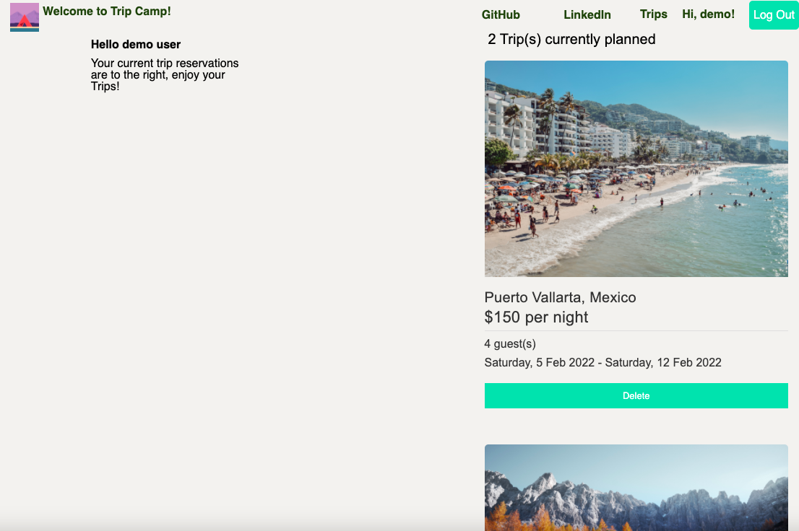

# README

## Overview

Tripcamp is a web application inspired by the website [Hipcamp](https://www.hipcamp.com/en-US) a popular vacations and campsite rental booking service. Trip camp focuses on the niche of  finding and booking camping spots from around the world.

Users who make accounts can book spots and write reviews.

### Live Site [Tripcamp](http://trip-camp.herokuapp.com/#/)

## Technologies

* React.js 
* Redux.js
* AJAX
* Ruby on Rails
* jbuilder
* PostgreSQL
* AWS S3
* Heroku
* HTML
* SCSS

* Backend: This project utilizes Ruby on Rails with Postgresql for the backend,  and stores spot photos in a AWS server.

* Frontend: I used React and React-Redux to stucture the front end and process the data being queried with AJAX requests. With styling via HTML and SCSS for the front end and hosted the site on Heroku.


## Features

* Browse Locations: From the home page, anyone can look through the curated list of amazing locations.


* Leave Reviews: Users with accounts can create, edit and delete reviews for spots and tell others about their trips

<!--  -->


* Manage Bookings: Users are able to access and view their booked trips.




## Code

* One challenge that I had to overcome when coding out this website was properly manipulating the date information to display neatly and cleanly. I found a solution by using my knowledge of array manipulation to break down the integers and then use those to index into a list of strings I created for months and days to pull out more descriptive information.

```js
dateFormat(date) {
        const days = ['Sunday', 'Monday', 'Tuesday', 'Wednesday', 'Thursday', 'Friday', 'Saturday'];
        const months = ['Placeholder', 'Jan', 'Feb', 'Mar', 'Apr', 'May', 'Jun', 'Jul', 'Aug', 'Sep', 'Oct', 'Nov', 'Dec'];
        
        const splitted = date.split("-")

        const date_num = parseInt(splitted[2].slice(0, 2));
        const month = months[parseInt(splitted[1])];
        const year = parseInt(splitted[0]);

        const day_of_week = days[new Date(year, parseInt(splitted[1]) - 1, date_num).getDay()];
        return `${day_of_week}, ${date_num} ${month} ${year}`;
    }

```

* Another challenge I faced was making sure that the features on my website are reserved for users who have accounts. In addition to using protected and authorized routes for specific url locations I used for displaying feature components, I also used conditionals to hide buttons as well as rerouting the user to the login page when needed on button clicks. Basing these actions off of the information I pass through my components via state and props.

```js
        
    const delete_button = (this.props.session === this.props.review.authorId ? <button onClick={this.handleDelete} className="review-delete-button">Delete Review</button> : null)
        
    const edit_button = (this.props.session === this.props.review.authorId ? < Link to={`/spots/${review.spotId}/reviews/${review.id}`} className="review-edit-button"> Edit Review</Link> : null)


```


